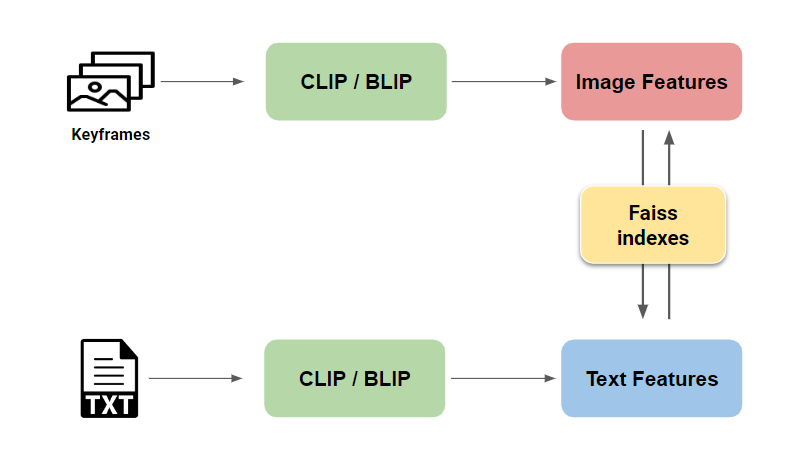

# SIU_Minerva: Multimedia information retrieval system in AIC2023

The system was used in AIC 2023 for event retrieval purpose. In this system, we focused on using Text-Image and Image-Image retrieval which based on [CLIP-ViT-L14](https://huggingface.co/docs/transformers/model_doc/clip) and [BLIP2](https://github.com/salesforce/LAVIS/tree/main/projects/blip2).

<p align="center">

</p>

## 1. Installation
### Text-Image & Image-Image Search
We use [conda_env](https://conda.io/projects/conda/en/latest/user-guide/tasks/manage-environments.html#activating-an-environment) to manage environments for independent retrieval methods.

```bash
# setup conda env
conda create --name lavis python=3.8 -y
conda activate lavis
# install packages
python3 -m pip install transformers salesforce-lavis
# install faiss
conda install -c conda-forge faiss-gpu
```

Faiss is a library for efficient similarity search and clustering of dense vectors. The document can be found [here](https://github.com/facebookresearch/faiss/wiki).

### Translation
We applied translation process (Eng-Vie) into the system to enhance user's experience in Text-Image search. The model used for translation can be found in [VinAI_Translate](https://github.com/VinAIResearch/VinAI_Translate) repository.

```bash
# setup conda env
conda create --name translate
conda activate translate
# install packages
python3 -m pip install transformers sentencepiece tokenizers
```

### Other configurations
+ Urllib3: ```pip install urllib3``` 
+ OpenCV tools: ```pip install opencv-python```


## 2. Dataset

### Structure
We construct the dataset following:
```
edited
|
├── 0
|   ├── features
|   |       └── blip_vitl
|   |       └── clip_l14
|   ├── frames
|   |       └── Keyframes_L01
|   |               └── keyframes
|   |                       ├── L01_V001
|   |                       |       ├── image1.png
|   |                       |       └── ...
|   |                       └── L01_V002 ...
|   └── thumbnails
|           └── (structure same as 'frames' folder)
|
├── 1 ...
|
└── 2 ...
```

### Features extraction
We need to extract features of keyframes in `/frames` folder. Numpy files from extracting would be stored in `/features/blip_vitl` (Blip2-ViTL) and `/features/clip_l14` (Clip-ViT-L14).

[Tmux](https://tmuxcheatsheet.com/) is very useful for running multiple programs with a single connection, such as when you're remotely connecting to a machine using Secure Shell (SSH).

+ Clip-ViT-L14:
```bash
# setup tmux session
tmux new -s clip_extraction
# activate CLIP env
conda activate lavis
# extract features
cd feature_extract
CUDA_VISIBLE_DEVICES=2,3 taskset -c 0-25 python clip_feature_extraction.py
```
+ Blip2-ViTL:
```bash
# setup tmux session
tmux new -s blip_extraction
# activate BLIP env
conda activate lavis
# extract features
cd feature_extract
CUDA_VISIBLE_DEVICES=2,3 taskset -c 30-55 python blip_feature_extraction.py
```

 ## 3. How to use system

 ### Run APIs
 Note: The indexes followed `CUDA_VISIBLE_DEVICES` should be changed to appropriate to available GPUs.
 + Clip Text-Image search:
 ```bash
# setup tmux session
tmux new -s clip_text_search
# activate lavis env
conda activate lavis
# run api
cd /source/api
CUDA_VISIBLE_DEVICES=2,3 python text_search_clip_l14_api.py
 ```

 + Blip Text-Image search:
```bash
# setup tmux session
tmux new -s blip_text_search
# activate lavis env
conda activate lavis
# run api
cd /source/api
CUDA_VISIBLE_DEVICES=2,3 python text_search_blip_vitl_api.py
 ```

 + Image-Image search:
```bash
# setup tmux session
tmux new -s image_search
# activate lavis env
conda activate lavis
# run api
cd /source/api
CUDA_VISIBLE_DEVICES=2,3 python image_search_api.py
 ```

 + Translation:
```bash
# setup tmux session
tmux new -s translation
# activate translation env
conda activate translate
# run api
cd /source/api
CUDA_VISIBLE_DEVICES=2,3 python translate.py
```

### Visualization:
To visualise the result from retrieval process, the images or videos would be displayed on a webpage. You can modify webpage based on [this file](web/templates/web.html).

To run this web on local:
```bash
cd web
python web.py
```

This is a demo for our system:
<video control autoplay src="./doc/demo.mp4" type="video/mp4"></video>


